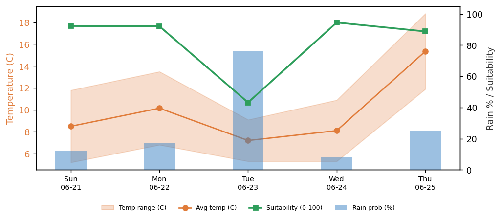
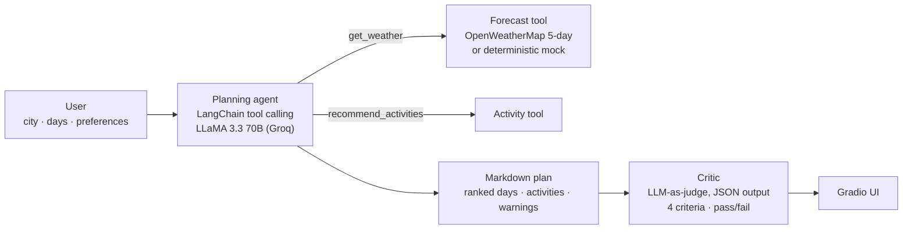

# Weather-Aware Travel Planning Agent

[](https://github.com/dorukozcan/weather-aware-travel-agent/actions/workflows/tests.yml)


An agentic AI app that plans trips around the weather. Give it a city, a trip
length and your preferences; a **LangChain tool-calling agent** running
**LLaMA 3.3 70B on Groq** fetches the forecast, ranks the days, suggests
weather-appropriate activities and flags risky conditions. A separate
**LLM-as-judge critic** then grades every plan and returns pass/fail.

**Live demo:** [huggingface.co/spaces/dorukozcan/travel-agent](https://huggingface.co/spaces/dorukozcan/travel-agent)
(free tier: the Space sleeps when idle, so the first load can take a minute).



## How it works



1. **Autonomous loop.** The agent decides which tools to call and in what order
   (`create_tool_calling_agent` + `AgentExecutor`, capped at 8 iterations). Every
   tool call is recorded and shown in the UI as a reasoning trace.
2. **Tools.** `get_weather` groups OpenWeatherMap's 3-hourly data into daily
   summaries (worst condition of the day, temperature range, rain probability,
   rain amount, wind, humidity). `recommend_activities` maps condition and
   temperature to indoor or outdoor ideas, biased by the user's preferences.
3. **Critic.** A second model call at temperature 0 scores the plan from 1 to 5 on
   **accuracy, usefulness, safety and coherence** and returns strict JSON with a
   verdict and written feedback.
4. **Graceful degradation.** If the LLM call fails, the app falls back to a
   deterministic rule-based controller that runs the same
   decide → act → observe loop, so the UI never breaks.

## Runs without API keys

| Mode | Trigger | Planner | Weather | Evaluator |
|------|---------|---------|---------|-----------|
| Demo | no keys | rule-based controller | deterministic mock | heuristic |
| Agent | `GROQ_API_KEY` | LLaMA 3.3 70B agent | mock | LLM critic |
| Full | `GROQ_API_KEY` + `OPENWEATHER_API_KEY` | LLaMA 3.3 70B agent | live OpenWeatherMap | LLM critic |

Both keys are free. Adding them upgrades the app in place, with no code changes.

## Quick start

```bash
git clone https://github.com/dorukozcan/weather-aware-travel-agent.git
cd weather-aware-travel-agent
pip install -r requirements.txt

cp .env.example .env        # optional: paste your Groq / OpenWeatherMap keys

python app.py               # Gradio UI at http://127.0.0.1:7860
python test_smoke.py        # offline end-to-end tests (no keys needed)
python run_evaluation.py    # batch evaluation -> eval_results.json
```

Get the keys at [console.groq.com/keys](https://console.groq.com/keys) and
[home.openweathermap.org/api_keys](https://home.openweathermap.org/api_keys).
`DEPLOYMENT_GUIDE.md` covers deploying to Hugging Face Spaces.

## Evaluation

`run_evaluation.py` plans trips for 8 cities with different climates, scores
each plan, and then runs a **discrimination test**: it feeds the evaluator a
deliberately broken plan (no warnings, no real activities) for 4 cities and
checks that it fails them. An evaluator that passes everything is useless.

The committed `eval_results.json` was produced in **demo mode**:

| Metric | Result |
|--------|--------|
| Good plans passing | 8 / 8 |
| Broken plans passing | 0 / 4 |

**What this does and does not show.** It shows the evaluation harness can tell
a complete, safety-aware plan from a broken one. It does *not* measure the LLM
agent's quality: in demo mode the plans come from the rule-based controller, and
the heuristic evaluator uses the same day-risk definition (`score_day`) as the
planner. Running the harness in full mode with the LLM critic is the next step.

## Tests

`test_smoke.py` runs 6 offline end-to-end tests in demo mode: forecast shape,
mock determinism, activity mapping, plan + evaluation, rejection of a broken
plan, and the Gradio handler. They run on every push via GitHub Actions.

## Project structure

| File | Purpose |
|------|---------|
| `app.py` | Gradio UI (also the Hugging Face Spaces entry point) |
| `agent.py` | LLM agent, rule-based fallback and the shared day scorer |
| `tools.py` | Forecast tool (OpenWeatherMap + mock) and activity tool |
| `evaluation.py` | LLM critic and heuristic evaluator |
| `run_evaluation.py` | Batch evaluation and discrimination test |
| `test_smoke.py` | Offline end-to-end tests |
| `config.py` | Environment variables and mode detection |

## Limitations and next steps

- Evaluate the LLM agent itself: run `run_evaluation.py` in full mode across
  more cities and report the critic's scores.
- Use a different model family for the critic than for the planner, to reduce
  self-preference bias.
- The OpenWeatherMap free tier limits plans to a 5-day window.

## Tech stack

Python · LangChain · Groq (LLaMA 3.3 70B) · OpenWeatherMap API · Gradio ·
Matplotlib · Hugging Face Spaces · GitHub Actions

## Author

**Doruk Özcan** · [LinkedIn](https://www.linkedin.com/in/doruk-ozcan)

Built as a solo semester project (SEN4018) at Bahçeşehir University, 2026.
Released under the MIT License.
